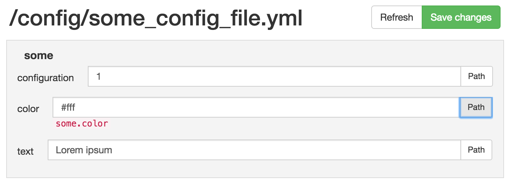

# YamlConfigBundle
A simple configuration bundle to setup fast config-based conditional code like that:
```php
<?php
namespace AppBundle\Controller;
use Symfony\Bundle\FrameworkBundle\Controller\Controller;

class DefaultController extends Controller
{
    public function indexAction()
    {
        if ($this->get('itf.yconf')->get('some.configuration') == true) {
            // do stuff
        } 
    }
}
```

Using this example configuration file:
```yml
some:
    configuration: 1
    color: #fff
    text: 'Lorem ipsum'
```

# Installation
```
composer require itf/yaml-config-bundle "dev-master"
```

Activate the bundle in the `AppKernel.php` file:
```php
public function registerBundles() 
{
    $bundles = array(
        //[...]
        new \ITF\YamlConfigBundle\YamlConfigBundle()
    );
    // ...
}    
```

Then, add this to your `config.yml` file:
```yaml
imports:
    - { resource: @YamlConfigBundle/Resources/config/services.yml }

#... 
    
yaml_config:
    file_path: "%kernel.root_dir%/config/some_config_file.yml"
```
**Hint:** Do not insert path to your global `config.yml` file, but instead create a new one. If the file does not exist, it will be created automatically.

Last step is to add routing to your `routing.yml` as follows:
```yml
yaml_config:
    resource: "@YamlConfigBundle/Resources/config/routing.yml"
    prefix:   /_config
```

Finally, install the assets:
```
php app/console assets:install
```

# Usage
You are now ready to use the service `itf.yconf` where ever you want. E.g. in a Controller (like the example above) or even in twig templates.

This bundle is using the [PropertyAccess component of symfony](http://symfony.com/doc/current/components/property_access/introduction.html) to access the configuration file. 

You can choose to edit the configuration file with a text editor or the Web-GUI. Open `http://localhost:8000/_config`:



### Use in twig templates
In order to get access to this service in twig templates, you need to add it to its globals. In your `config.yml` add this:
```
twig:
    globals:
       yconf: "@itf.yconf"
```
Now you can access it as easy as:
```twig

    <div style="background: {{ yconf.get('some.color') }};">
        {{ yconf.get('some.text') }}
    </div>

```


 
# Troubleshooting
**Why is it not saving my changes?**
Please make sure, that your configuration file has proper access rights. A `chmod 644 [path to config file]` should do it.

# License
MIT